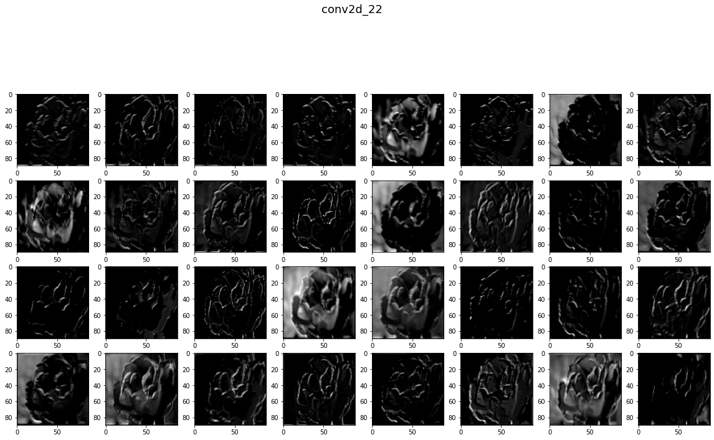

[](https://pypi.org/project/litten/)     


# Litten
Litten is a python package to visualize sequential Tensorflow(keras) neural network model architectures, Get layers summary in details, visualize conv layers filters and featurmaps. 

## Installation
To install latest version from PyPi
```bash
$ pip install litten
```

## How to use it?

1. Create your neural network archtictures

```python
model = keras.models.Sequential(
    [
        keras.layers.Conv2D(filters = 32, kernel_size = 3, input_shape = [150, 150, 3]),
        ...
        keras.layers.Dense(units = 2, activation = 'softmax')
    ]
)

# or using functional API

input = keras.Input(shape=(28, 28, 1), name="img")
...
output = keras.layers.Dense(units = 2, activation = 'softmax')(x)
model = keras.Model(input, output, name="Model")
```

2. Import LayersSummary, ModelVisualizer and create objects

```python
from litten import LayersSummary, ModelVisualizer
```

3. To get Layers Summaries
```python
summary = LayersSummary()
summary.show_layers_summaries(model)
```
Output:
```plaintext
=================================================================================================================
Layer 1: InputLayer     | Attributes
----------------------------------------
built                   :  True
sparse                  :  False
ragged                  :  False
batch_size              :  None
is_placeholder          :  True
=================================================================================================================
Layer 2: Conv2D         | Attributes
----------------------------------------
rank                    :  2
filters                 :  16
groups                  :  1
kernel_size             :  (3, 3)
strides                 :  (1, 1)
padding                 :  valid
data_format             :  channels_last
dilation_rate           :  (1, 1)
activation              :  <function relu at 0x7f6b7038fee0>
use_bias                :  True
kernel_initializer      :  <keras.initializers.initializers_v2.GlorotUniform object at 0x7f6aee189610>
bias_initializer        :  <keras.initializers.initializers_v2.Zeros object at 0x7f6aee189af0>
kernel_regularizer      :  None
bias_regularizer        :  None
kernel_constraint       :  None
bias_constraint         :  None
built                   :  True
=================================================================================================================
....
```

4. To visualize model architecture
    ```Plaintext
    ModelVisualizer.visualize_model(
        show_names=False,
        show_properties=False,
        show_connectors=False,
        pallete='default'
    )
    ```
    Example 1
    ```python
    vis = ModelVisualizer(model)
    vis.visualize_model()
    ```
    
    
        
    Example 2
    ```python
    vis.visualize_model(show_names=True)
    ```
    

    Example 3
    ```python
    vis.visualize_model(show_names=True, show_connectors = True)
    ```
    

    Exampel 4
    ```python
    vis.visualize_model(show_names=True, show_connectors = True, show_properties=True)
    ```
    

    Example 5
    You can choose one from these palettes `default`, `red`, `green`, `blue`, `yellow`, `brown`, `purple`, `gray`
    ```python
    vis.visualize_model(show_names=True, show_connectors=True, palette=<palette>)
    ```
    
    
    
    
    


5. To visualize Conv filters
    ```plaintext
        ModelVisualizer.visualize_filters(
            cmap = 'gray'   # matplotlib cmaps
        )
    ```
    Example
    ```python
    vis = ModelVisualizer(model)
    vis.visualize_filters('Blues')
    ```
    

6. To visualize Features map
    ```plaintext
    ModelVisualizer.visualize_featuremap(
        input_image,
        cmap = 'gray'   # matplotlib cmaps
    )
    ```
    Example
    ```python
    vis = ModelVisualizer(model)
    vis.visualize_featuremap(input_image, 'Blues')
    ```
    
    
    
    


## Contributing to `litten`

To contribute to litten, follow these steps:

1. Fork this repository.
2. Create a branch: `git checkout -b <branch_name>`.
3. Make your changes and commit them: `git commit -m '<commit_message>'`
4. Push to the original branch: `git push origin <project_name>/<location>`
5. Create the pull request.

Alternatively see the GitHub documentation on [creating a pull request](https://help.github.com/en/github/collaborating-with-issues-and-pull-requests/creating-a-pull-request).

## License
Open source licensed under the MIT license (see _LICENSE_ file for details).

## Tools
- Python
- PIL
- Matplotlib
- pytest